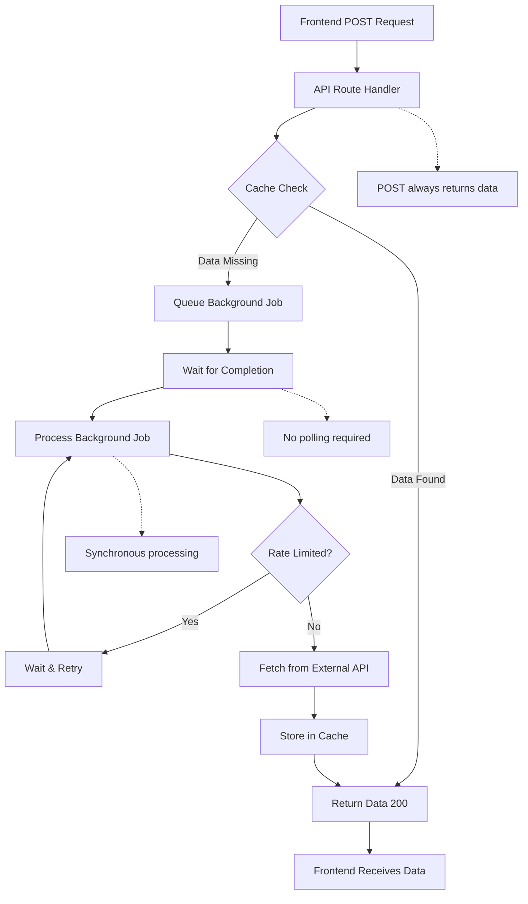
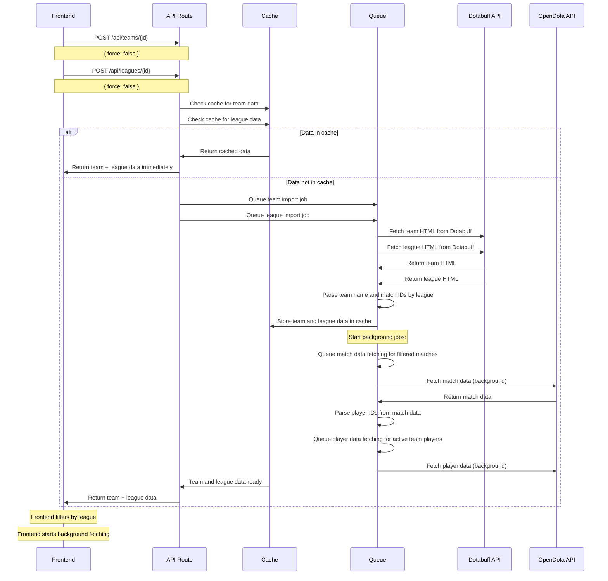
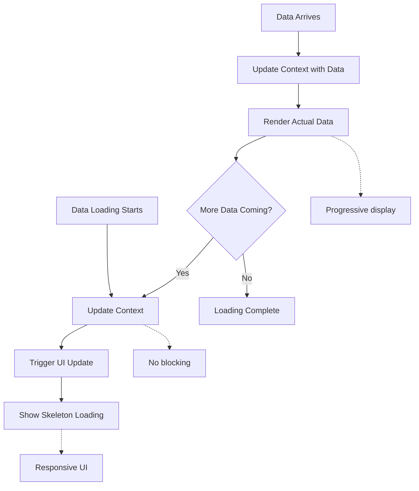

# Architecture: Simplified API Orchestration with Synchronous Data Loading

## Overview
This document describes the simplified architecture for handling data loading in the Dota Data dashboard. The system uses a single POST endpoint pattern that ensures data is always returned to the client, either immediately from cache or after waiting for background processing to complete.

---

## API Design Principles

### Simplified POST-Only Pattern
All API endpoints follow a single, simplified pattern using only POST requests:

1. **POST Endpoint Behavior**:
   - Check cache for requested data
   - If data exists: Return 200 with data immediately
   - If data missing: Queue background job and wait for completion
   - Always return 200 with the actual data (never 202 "queued" status)

2. **Benefits**:
   - **Simplified Frontend**: No need to handle different response types or polling
   - **Guaranteed Data**: POST always returns the data you need
   - **Synchronous Loading**: Request waits for background processing to complete
   - **Clear Semantics**: POST = "get me this data, even if you have to fetch it"

3. **Error Handling**:
   - 400: Invalid request parameters
   - 500: Server error during processing
   - No 404 responses (data is fetched if missing)

### Migration from GET/POST Pattern
The previous GET/POST pattern has been simplified:
- **Removed**: GET endpoints that only checked cache
- **Removed**: POST endpoints that returned 202 "queued" status
- **Simplified**: Single POST endpoint that always returns data

## Frontend Integration Architecture

### League Filtering Pattern
The frontend implements league filtering while the backend provides comprehensive data:

1. **Backend Data Provision**: `/api/teams/[id]` returns all matches organized by league
2. **Frontend Filtering**: Frontend selects league and filters displayed data
3. **League Validation**: Frontend validates league exists using `/api/leagues/[id]`
4. **Background Processing**: Frontend starts background fetching of filtered matches

### Real-Time Updates
The frontend implements real-time updates with the following patterns:

1. **Immediate Response**: All endpoints return data immediately (no polling)
2. **Background Processing**: Frontend can start background jobs for additional data
3. **Context Updates**: Frontend contexts update in real-time as data loads
4. **Loading States**: Frontend shows skeleton loading states during data fetching

### Error Handling Patterns
Standardized error handling for frontend integration:

1. **HTTP Status Codes**: 200 (success), 400 (bad request), 500 (server error)
2. **Error Messages**: Clear error messages for debugging
3. **League Validation**: Specific errors for missing leagues
4. **Empty States**: Support for empty data scenarios

## Data Flow Diagrams

### 1. Synchronous Data Loading Flow
The following flowchart shows how POST requests handle data loading:



### 2. Team Import Flow with League Filtering
The following sequence diagram shows the team import process with league filtering:



### 3. Frontend League Filtering Flow
The following flowchart shows how the frontend handles league filtering:

```mermaid
flowchart TD
    %% User Input
    USER[User enters Team ID + League ID] --> VALIDATE[Validate Input]
    
    %% Parallel API Calls
    VALIDATE --> PARALLEL[Call APIs in Parallel]
    PARALLEL --> TEAM_API[POST /api/teams/{id}]
    PARALLEL --> LEAGUE_API[POST /api/leagues/{id}]
    
    %% Validation
    TEAM_API --> CHECK_LEAGUE{League in Team Data?}
    LEAGUE_API --> CHECK_LEAGUE
    
    %% Error Path
    CHECK_LEAGUE -->|No| ERROR[Show Error: No matches for league]
    
    %% Success Path
    CHECK_LEAGUE -->|Yes| FILTER[Filter Matches by League]
    
    %% Background Processing
    FILTER --> BACKGROUND[Start Background Fetching]
    BACKGROUND --> FETCH_MATCHES[Fetch Match Details]
    FETCH_MATCHES --> EXTRACT_PLAYERS[Extract Player IDs]
    EXTRACT_PLAYERS --> FETCH_PLAYERS[Fetch Player Data]
    
    %% Real-Time Updates
    FETCH_MATCHES --> UPDATE_MATCHES[Update Match Context]
    FETCH_PLAYERS --> UPDATE_PLAYERS[Update Player Context]
    
    %% UI Updates
    UPDATE_MATCHES --> DISPLAY_MATCHES[Display Matches]
    UPDATE_PLAYERS --> DISPLAY_PLAYERS[Display Players]
    
    %% Notes
    N1[Real-time updates]
    N2[Skeleton loading states]
    N3[League-specific display]
    
    UPDATE_MATCHES -.-> N1
    DISPLAY_MATCHES -.-> N2
    DISPLAY_MATCHES -.-> N3
```

### 4. Real-Time Update Flow
The following flowchart shows how real-time updates work:



## System Architecture Diagrams

### Frontend Architecture
```
┌─────────────────────────────────────────────────────────────┐
│                    Frontend Components                     │
├─────────────────────────────────────────────────────────────┤
│  Pages                    │  Components                   │
│  ├─ Team Management       │  ├─ Match Cards              │
│  ├─ Match History         │  ├─ Player Stats              │
│  ├─ Player Stats          │  ├─ League Filter             │
│  └─ Other Pages           │  └─ Loading States            │
└─────────────────────────────────────────────────────────────┘
                              │
                              ▼
┌─────────────────────────────────────────────────────────────┐
│                    Context Layer                           │
├─────────────────────────────────────────────────────────────┤
│  Team Data Context        │  Match Data Context           │
│  ├─ Team Data            │  ├─ Matches                   │
│  ├─ League Data          │  ├─ Loading States            │
│  ├─ League Selection     │  └─ Real-time Updates        │
│  └─ Background Fetching  │                               │
└─────────────────────────────────────────────────────────────┘
                              │
                              ▼
┌─────────────────────────────────────────────────────────────┐
│                    API Layer                               │
├─────────────────────────────────────────────────────────────┤
│  POST /api/teams/[id]    │  POST /api/matches/[id]       │
│  POST /api/leagues/[id]  │  POST /api/players/[id]       │
│  POST /api/heroes        │  POST /api/items              │
└─────────────────────────────────────────────────────────────┘
```

### Data Flow Architecture
```
┌─────────────────┐    ┌─────────────────┐    ┌─────────────────┐
│   User Input    │    │  League Filter  │    │  Background     │
│                 │    │                 │    │  Processing     │
│ • Team ID       │───▶│ • League ID     │───▶│ • Match Data    │
│ • League ID     │    │ • Validation    │    │ • Player Data   │
└─────────────────┘    └─────────────────┘    └─────────────────┘
         │                       │                       │
         ▼                       ▼                       ▼
┌─────────────────┐    ┌─────────────────┐    ┌─────────────────┐
│  API Calls      │    │  Context        │    │  Real-time      │
│                 │    │  Updates        │    │  UI Updates     │
│ • Parallel      │    │ • Team Data     │    │ • Skeleton      │
│ • Validation    │    │ • Match Data    │    │ • Player Data   │
│ • Error Handle  │    │ • Player Data   │    │ • Real-time     │
└─────────────────┘    └─────────────────┘    └─────────────────┘
```

## Key Architectural Decisions

### 1. League Filtering Strategy
- **Backend**: Provides comprehensive data for all leagues
- **Frontend**: Filters and displays league-specific data
- **Validation**: Frontend validates league exists before proceeding
- **Flexibility**: Easy to switch between leagues without re-fetching

### 2. Real-Time Updates
- **Context Updates**: React contexts update as data loads
- **Skeleton Loading**: Show loading states during data fetching
- **Progressive Display**: Display data as it becomes available
- **Responsive UI**: Maintain responsive interface throughout

### 3. Background Processing
- **Parallel Fetching**: Fetch all matches in parallel
- **Player Extraction**: Extract player IDs from match data
- **Active Team Only**: Only fetch data for active team players
- **Deduplication**: Avoid duplicate player data requests

### 4. Error Handling
- **League Validation**: Specific errors for missing leagues
- **Empty States**: Generic messages for no data scenarios
- **Manual Add**: Support for manual data addition
- **Clear Messages**: Specific error messages for debugging

## Implementation Benefits

### 1. Simplified Frontend Code
- No complex polling logic
- Direct data loading patterns
- Clear error handling
- Standardized API calls

### 2. Better User Experience
- Immediate data availability
- Real-time updates
- Responsive loading states
- League-specific filtering

### 3. Improved Performance
- No unnecessary polling requests
- Parallel data fetching
- Efficient caching
- Background processing

### 4. Easier Maintenance
- Standardized API patterns
- Clear separation of concerns
- Modular component structure
- Comprehensive error handling

## Testing Strategy

### 1. API Testing
- Test all endpoints with standardized POST pattern
- Verify error handling scenarios
- Test cache behavior and force refresh
- Validate league filtering functionality

### 2. Frontend Testing
- Test league filtering functionality
- Test real-time data updates
- Test error handling scenarios
- Test empty state handling
- Test background data fetching

### 3. Integration Testing
- Test end-to-end data flow
- Test league validation
- Test background processing
- Test real-time updates

This architecture provides a robust foundation for the Dota Data dashboard with simplified API patterns, efficient data loading, and excellent user experience. 