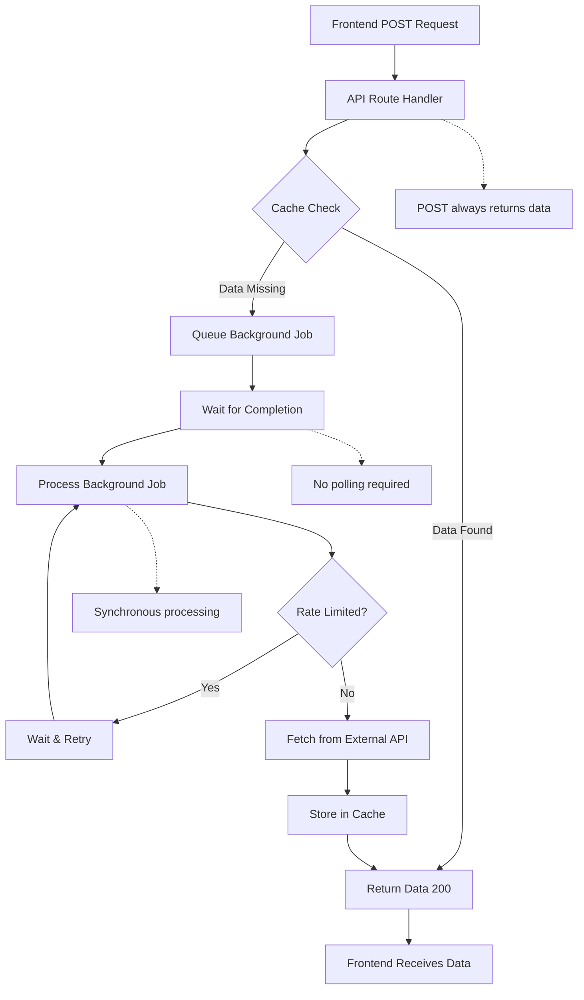
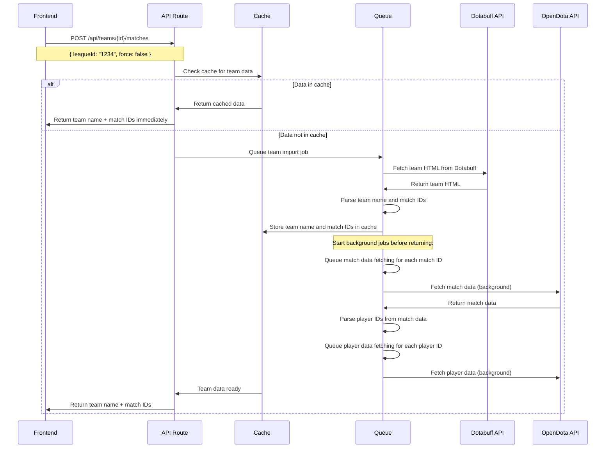
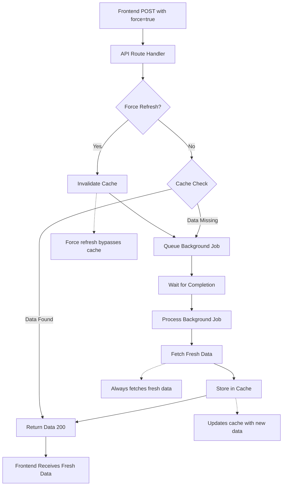
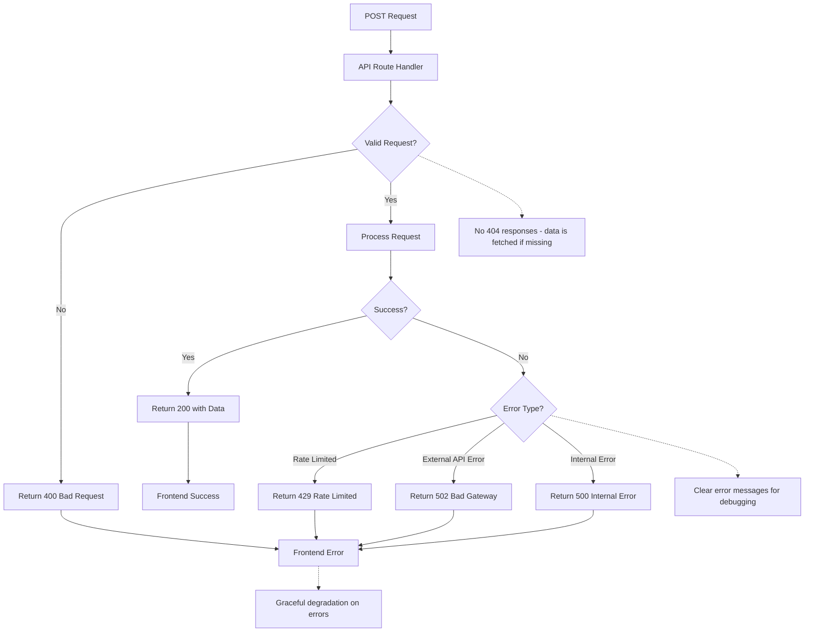
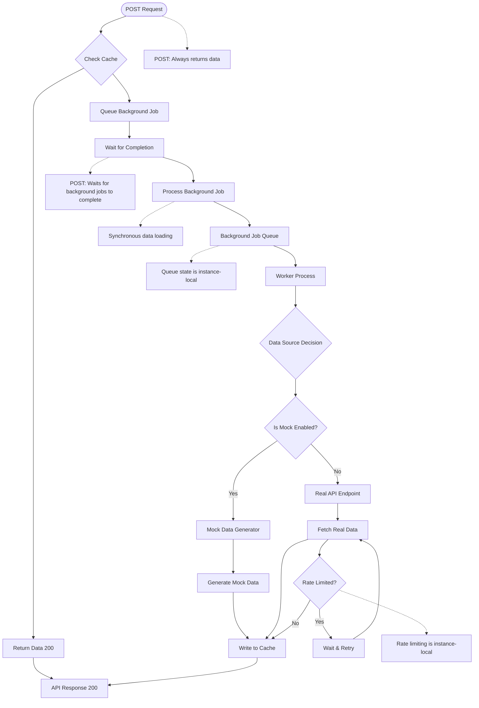
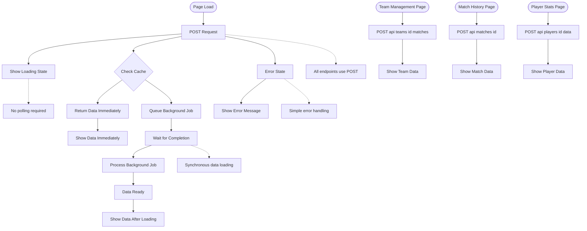
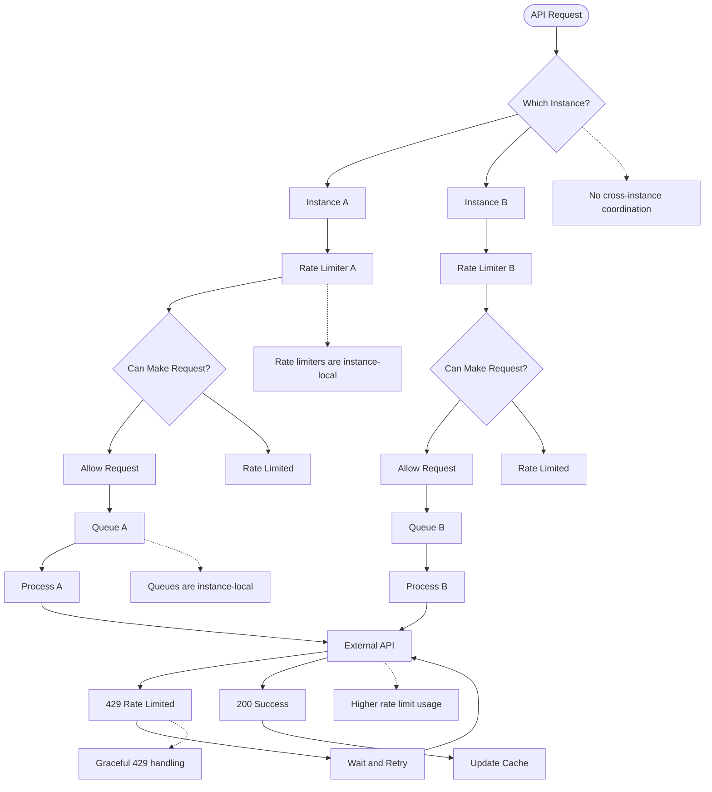

# Architecture: Simplified API Orchestration with Synchronous Data Loading

## Overview
This document describes the simplified architecture for handling data loading in the Dota Data dashboard. The system uses a single POST endpoint pattern that ensures data is always returned to the client, either immediately from cache or after waiting for background processing to complete.

---

## API Design Principles

### Simplified POST-Only Pattern
All API endpoints follow a single, simplified pattern using only POST requests:

1. **POST Endpoint Behavior**:
   - Check cache for requested data
   - If data exists: Return 200 with data immediately
   - If data missing: Queue background job and wait for completion
   - Always return 200 with the actual data (never 202 "queued" status)

2. **Benefits**:
   - **Simplified Frontend**: No need to handle different response types or polling
   - **Guaranteed Data**: POST always returns the data you need
   - **Synchronous Loading**: Request waits for background processing to complete
   - **Clear Semantics**: POST = "get me this data, even if you have to fetch it"

3. **Error Handling**:
   - 400: Invalid request parameters
   - 500: Server error during processing
   - No 404 responses (data is fetched if missing)

### Migration from GET/POST Pattern
The previous GET/POST pattern has been simplified:
- **Removed**: GET endpoints that only checked cache
- **Removed**: POST endpoints that returned 202 "queued" status
- **Simplified**: Single POST endpoint that always returns data

## Data Flow Diagrams

### 1. Synchronous Data Loading Flow
The following flowchart shows how POST requests handle data loading:



### 2. Team Import Flow
The following sequence diagram shows the team import process:



### 3. Force Refresh Flow
The following flowchart shows how force refresh works:



### 4. Error Handling Flow
The following flowchart shows error handling patterns:



## System Architecture Diagrams

### Simplified API Orchestration Flow
The following diagram shows the simplified orchestration pattern used across all API endpoints:



### Frontend Data Loading Pattern
The following diagram shows how the frontend handles data loading with the simplified synchronous approach:



### Rate Limiting and Queue Management
The following diagram shows how rate limiting and queue management work in the serverless environment:



## Current Architecture Decisions

### Simplified GET/POST Pattern
All data endpoints follow a consistent pattern:

- **GET**: Check cache and return data if available, 404 if not found
- **POST**: Check cache and return ready status if available, or queue background job and return queued status

### Instance-Local Rate Limiting
Rate limiting is implemented per-instance using in-memory storage:

```typescript
// rate-limiter.ts
private requestCounts: Map<string, number[]> = new Map();
private lastRequestTimes: Map<string, number> = new Map();
private backoffTimes: Map<string, number> = new Map();
```

### Fire-and-Forget Background Jobs
Background jobs are queued and processed asynchronously:

1. **Route enqueues request** and returns immediately
2. **Queue processor handles** the actual API call
3. **Results are cached** for future requests
4. **No blocking** of the main request flow

### Serverless Environment Constraints
The application is deployed on Vercel's free tier, which means:
- Multiple serverless instances may handle requests simultaneously
- No shared memory between instances
- Limited external service dependencies

### Trade-offs Accepted
- **Higher rate limit usage** (multiple instances)
- **Potential duplicate processing** (mitigated by queue deduplication)
- **No cross-instance coordination** (each instance operates independently)
- **Imperfect rate limiting** (but functional for most use cases)

## Team Management Flow

### Hybrid Loading Pattern
The frontend uses a hybrid approach for data loading:

1. **Immediate responses** when data is cached
2. **Background loading** for heavy operations
3. **Suspense/lazy loading** for responsive UI
4. **Independent endpoints** for different data types

### Example Implementation
```typescript
// Team management page
const loadTeam = async () => {
  // Kick off team import (returns immediately if cached)
  const response = await fetch('/api/teams/123/matches', {
    method: 'POST',
    body: JSON.stringify({ leagueId: '456' })
  });
  
  if (response.status === 200) {
    const data = await response.json();
    setTeamData(data); // Team name, league name available immediately
  }
  
  // Match/player data loaded independently via other endpoints
};
```

## Graceful Rate Limit Handling

When external services return 429 (rate limited), the application:

1. **Uses retry headers** if provided by the service
2. **Waits default amount of time** (60 seconds) if no retry header
3. **Implements exponential backoff** for repeated failures
4. **Logs rate limit events** for monitoring

```typescript
async function fetchWithRetry(url: string, options: RequestInit) {
  const maxRetries = 3;
  let attempt = 0;
  
  while (attempt < maxRetries) {
    try {
      const response = await fetch(url, options);
      
      if (response.status === 429) { // Rate limited
        const retryAfter = response.headers.get('Retry-After');
        const waitTime = retryAfter ? parseInt(retryAfter) * 1000 : 60000;
        
        console.log(`Rate limited, waiting ${waitTime}ms before retry`);
        await new Promise(resolve => setTimeout(resolve, waitTime));
        attempt++;
        continue;
      }
      
      return response;
    } catch (error) {
      attempt++;
      if (attempt >= maxRetries) throw error;
      
      // Exponential backoff
      const waitTime = Math.pow(2, attempt) * 1000;
      await new Promise(resolve => setTimeout(resolve, waitTime));
    }
  }
}
```

## Future Considerations

### When to Upgrade
Consider upgrading to external services when:
- **Rate limiting becomes problematic** (frequent 429s)
- **Queue coordination is needed** (cross-instance state)
- **Higher reliability required** (persistent queue state)
- **Budget allows** for paid services

### Potential Upgrades
- **Redis-based rate limiting** for cross-instance coordination
- **Bull/BullMQ** for robust queue management
- **Database persistence** for critical state
- **External queue services** (AWS SQS, Google Cloud Tasks)

## Monitoring and Debugging

### Logging
All rate limiting and queue operations are logged:

```typescript
logWithTimestampToFile('log', `[RateLimiter] Rate limit check for ${service}: ${requests.length}/${config.maxRequests}`);
logWithTimestampToFile('log', `[RequestQueue] Enqueued request ${requestId} for ${service}`);
```

### Queue Stats
Queue statistics are available for monitoring:

```typescript
const stats = cacheService.getQueueStats();
const activeSignatures = cacheService.getActiveSignatures();
```

### Error Handling
- **Rate limit events** are logged and handled gracefully
- **Queue failures** are logged and retried
- **Cache misses** are logged for debugging 