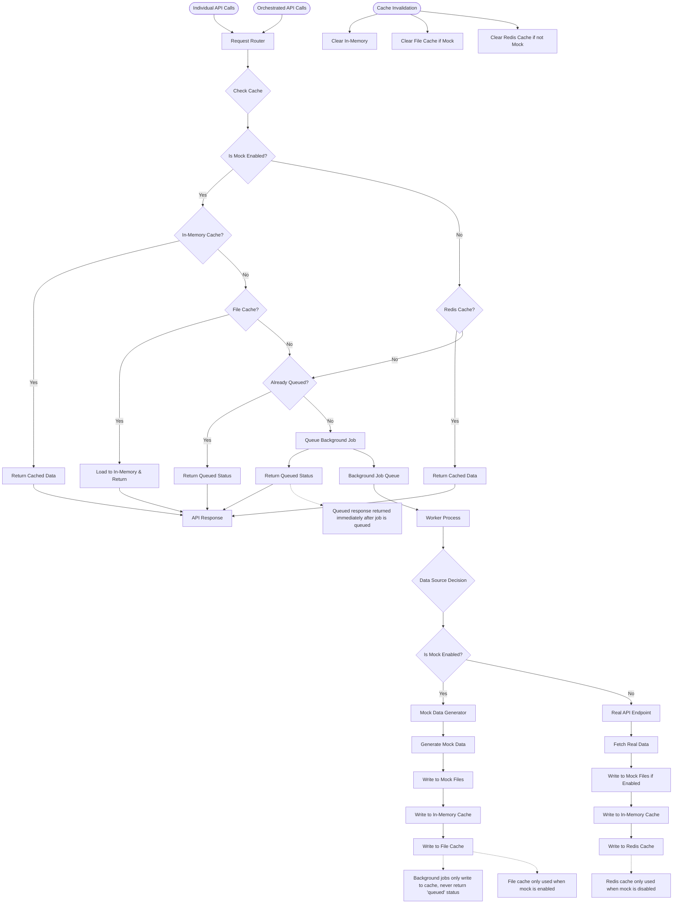
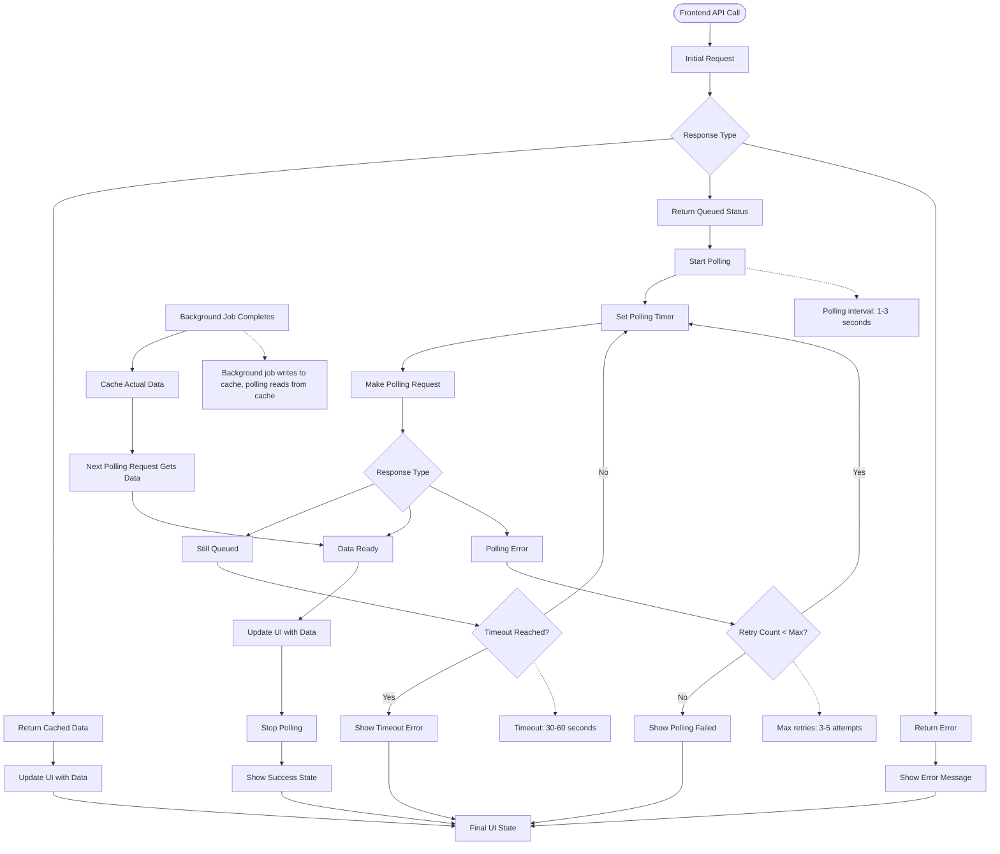

# Architecture: Team Import, Match & Player Queueing, and Refresh Semantics

## Overview
This document describes the architecture and design decisions for handling team import, background queueing of match and player data, and the refresh/force refresh logic in the Dota Data dashboard.

---

## System Architecture Diagrams

### Generic Caching System
The following diagram shows the unified caching, queueing, and mocking system used across all API endpoints:

### Data Polling Flow
The following diagram shows how the frontend polls for queued data and handles the transition from "queued" status to actual data:

### Dotabuff Team Matches Flow
The following diagram shows the specific flow for team import and match/player data orchestration:

```mermaid
flowchart TD
    %% Team/Matches API Flow
    AA([User/API calls team/id/matches])
    AA --> AB[Orchestration: Get Team & Match IDs]
    AB --> AC[Check Force Refresh or Refresh]
    AC --> AD{Is Force Refresh?}
    AD -- Yes --> AE[Invalidate Cache for All Relevant Parts]
    AD -- No --> AF{Is Refresh?}
    AF -- Yes --> AG[Invalidate Dotabuff Team Matches]
    AF -- No --> AH[Continue to Team Processing]
    AE --> AH
    AG --> AH
    AH --> AI[Fetch Dotabuff Team HTML]
    AI --> AJ{Is Mock Enabled?}
    AJ -- Yes --> AK[Generate Mock Dotabuff HTML]
    AK --> AK2[Write Mock HTML to Mock File]
    AJ -- No --> AL[Fetch from Real Dotabuff Website]
    AL --> AM[Write Dotabuff HTML to Cache]
    AK2 --> AM
    AM --> AN[Parse HTML to Extract Match IDs]
    AN --> AO[For each matchId: Call getMatch with teamId]
    AO --> A[API Request for Match Data]

    %% Individual Match API Flow
    BB([User/API calls matches/id])
    BB --> A

    %% Individual Player API Flow  
    CC([User/API calls players/id/data])
    CC --> DD[API Request for Player Data]

    %% Shared Match Data Flow
    A --> B{Is Data in In-Memory Cache?}
    B -- Yes --> C[Return Cached Data]
    B -- No --> D{Is Data in File Cache?}
    D -- Yes --> E[Load Data to In-Memory Cache & Return]
    D -- No --> F{Is Job Already Queued?}
    F -- Yes --> G[Return status: 'queued']
    F -- No --> H[Queue Background Job]
    H --> I[Return status: 'queued']
    I --> J[Background Job Fetches Data]
    J --> K{Is Mock Enabled?}
    K -- Yes --> L[Generate Mock Match Data]
    L --> L2[Write Mock Match Data to Mock File]
    K -- No --> M[Fetch from Real OpenDota API]
    M --> N[Write Data to In-Memory Cache]
    L2 --> N
    N --> O[Write Data to File Cache]
    O --> P[Queue Player Jobs for Each Player in Match]
    P --> DD

    %% Shared Player Data Flow
    DD --> U{Is Player Data in In-Memory Cache?}
    U -- Yes --> V[Return Cached Player Data]
    U -- No --> W{Is Player Data in File Cache?}
    W -- Yes --> X[Load Player Data to In-Memory Cache & Return]
    W -- No --> Y{Is Player Job Already Queued?}
    Y -- Yes --> Z[Return status: 'queued']
    Y -- No --> AA2[Queue Player Background Job]
    AA2 --> BB2[Return status: 'queued']
    BB2 --> CC2[Player Background Job Fetches Data]
    CC2 --> DD2{Is Mock Enabled?}
    DD2 -- Yes --> EE[Generate Mock Player Data]
    EE --> EE2[Write Mock Player Data to Mock File]
    DD2 -- No --> FF[Fetch from Real OpenDota API]
    FF --> GG[Write Player Data to In-Memory Cache]
    EE2 --> GG
    GG --> HH[Write Player Data to File Cache]
    HH --> R[End]

    %% Notes
    II[Only the background job writes to the cache files. 'queued' status is never written to disk.]
    JJ[API returns 'queued' status if job is in progress, actual data when ready.]
    O -.-> II
    I -.-> JJ
```

### Team/League Import Flow
1. **User Action:** User adds a team/league via the import form.
2. **Frontend:** Optimistically adds the team to the UI (team list) with a loading state.
3. **Backend:**
   - Fetches team and league names.
   - Parses and returns match IDs for the team/league.
   - **Immediately enqueues background jobs for each match** (if not already cached).
   - As each match is processed, **extracts player IDs for players on the imported team's side** and enqueues background jobs for those players.

## Optimistic UI
- The team appears immediately in the team list, even before all data is loaded.
- The UI updates as data becomes available.

## Background Queueing for Matches & Players
- **Backend-centric:** All queueing for match and player data is triggered on the backend, not the frontend.
- **Deduplication:** The backend ensures jobs are not re-queued for matches/players already being processed or cached.
- **Responsiveness:** The frontend remains simple and responsive, only polling for status and updating UI as data arrives.

## Refresh & Force Refresh
- **Force Refresh:**
  - Invalidates all relevant cache (dotabuff team, matches, players).
  - Re-enqueues all jobs for team, matches, and players.
- **Refresh:**
  - Only invalidates or bypasses the cache for the team data.
  - Fetches new matches and enqueues jobs for any new matches/players.
- **UI:**
  - Buttons for both actions are present and trigger the correct backend logic.

## Queue Status
- The backend exposes an endpoint (or websocket) for the frontend to query the status of enqueued jobs (per service: dotabuff, opendota, etc.).
- The sidebar or a dedicated UI component polls or subscribes to this endpoint and updates the queue status in real time.

## Rationale
- **Centralizing queueing on the backend** ensures consistency, avoids race conditions, and simplifies the frontend.
- **Frontend remains responsive** and can show partial data as it becomes available.
- **Queue status is surfaced to the user** for transparency and better UX.
- **Refresh and force refresh** are clearly separated in logic and UI.

## Implementation Steps
1. Centralize all match/player queueing logic on the backend (team import and refresh handlers).
2. Expose a queue status endpoint for the frontend to poll or subscribe to.
3. Update the frontend to poll for queue status and update the UI accordingly.
4. Keep this document updated as the architecture evolves.

## Polling and Async Data Pattern

In serverless and distributed environments, real-time queue internals (such as queue length, active signatures, or job status) are not exposed to the frontend. Instead, the frontend should use a polling pattern:

- When a user triggers a background job (e.g., team import), the backend returns a status such as `{ status: 'queued' }`.
- The frontend polls the data endpoint (not a queue status endpoint) every few seconds.
- When the data is ready, the endpoint returns the data and the frontend updates the UI.
- While waiting, the frontend shows a suspense/loading state.

**Note:** Queue internals are not exposed because in-memory queue state is not shared across serverless/serverful processes, and persistent queue state is not implemented in this project. This pattern is robust and works for all deployment targets. 