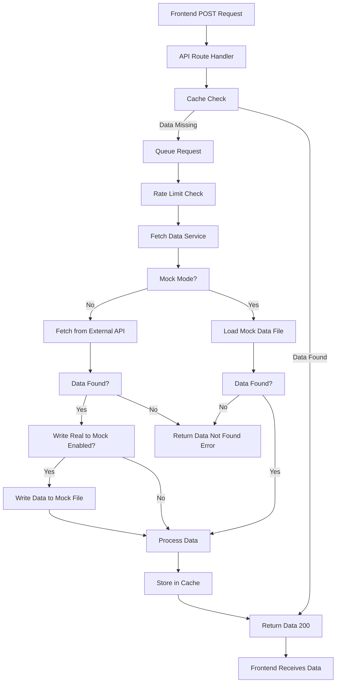
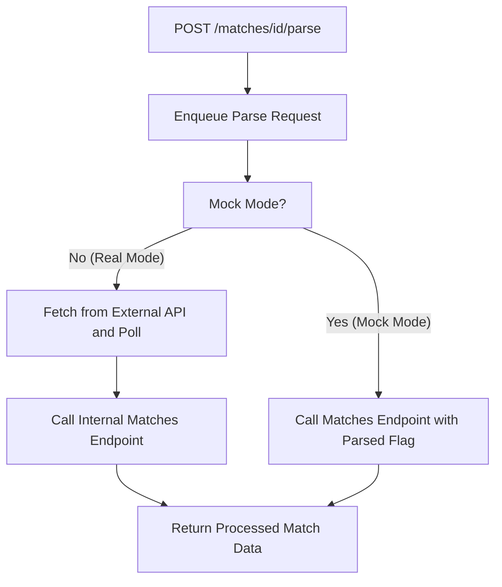

# Backend Data Flow Architecture

## Overview

The backend data flow is controlled by environment variables that determine mock mode, rate limiting, and data processing behavior. For complete environment variable documentation, see [Environment Variables](../development/environment-variables.md).

---

## Data Fetching Modes

There are three main modes/behaviors:

- **Mock mode:** If enabled, the service attempts to load a mock data file. If found, it is processed, cached, and returned. If not, an error is returned.
- **Real mode:** If not in mock mode, the service fetches from the external API. If data is found, it is processed, cached, and returned. If not, an error is returned.
- **Write Real to Mock:** If the environment variable `WRITE_REAL_DATA_TO_MOCK` is enabled, the raw data fetched from the external API is also written to the corresponding mock data file before processing, caching, and returning it. Only data-fetching endpoints support this flag.

*See [Environment Variables](../development/environment-variables.md) for configuration options to enable/disable mock mode and write real to mock functionality.*

---

## Caching, Rate Limiting, and Queueing Layers (Overview)

The backend uses three tightly integrated layers to manage data fetching, performance, and reliability:

- **[Caching Layer](./caching-layer.md):** Stores and retrieves API data to reduce redundant requests and improve performance. Supports Redis (production) and in-memory/file-based cache (mock/development).
- **[Rate Limiting Layer](./rate-limiting-layer.md):** Prevents exceeding external API rate limits and simulates rate limits in mock mode. Supports per-service limits, delays, backoff, and logging.
- **[Queueing Layer](./queueing-layer.md):** Ensures requests are processed in order, deduplicates in-progress requests, and supports background processing with QStash and memory fallback.

---

## General Synchronous Data Loading Flow

All API data fetches go through these layers in sequence: cache check → queue → rate limit → fetch/store.

This diagram shows the unified backend flow for all standard API endpoints, now explicitly including queueing and rate limiting for both mock and real modes:



**Summary:** On a cache miss, the request is queued, rate-limited, and then either loads mock data or fetches from the external API, processes and caches the result, and returns it to the client.

---

## Error Handling

- If data is not found, endpoints return a 404 status with a JSON body:
  ```json
  { "error": "Data Not Found" }
  ```
- If data processing fails, endpoints return a 500 status with a message and stack trace or error details:
  ```json
  { "error": "Failed to process [resource]", "details": "[stack trace or error message]" }
  ```
- **Note:** Error responses are standardized across all endpoints for consistency and easier frontend handling.

---

## Special Cases

Some endpoints have special handling or logic. The following table summarizes these cases for quick reference.

### Match Parsing Endpoint

The `/matches/{id}/parse` endpoint enqueues a parse request, then:

- In **real mode**, fetches from the external API and polls for completion, then calls the internal `/matches/{id}` endpoint to return processed match data.
- In **mock mode**, directly calls the internal `/matches/{id}` endpoint with the parsed flag to return processed mock data.




- **Real mode:** Enqueues the parse, fetches and polls for completion, then returns processed match data via the internal endpoint.
- **Mock mode:** Enqueues the parse, then immediately returns processed mock data via the internal endpoint with the parsed flag.

---

### Matches Endpoint: Data Selection Logic

The following table summarizes the logic used by the Matches Endpoint (`/matches/{id}`) to determine which data to return in mock and real modes, based on the presence of parsed/unparsed files and the parsed flag:

| Mode | Is Parsed Requested? | Unparsed File Exists? | Parsed File Exists? | Result (Always Processed) |
| ---- | -------------------- | --------------------- | ------------------- | ------------------------- |
| Mock | No                   | Yes                   | Any                 | Process & Return Unparsed |
| Mock | No                   | No                    | Yes                 | Process & Return Parsed   |
| Mock | No                   | No                    | No                  | Data Not Found Error      |
| Mock | Yes                  | Any                   | Yes                 | Process & Return Parsed   |
| Mock | Yes                  | Any                   | No                  | Data Not Found Error      |
| Real | Any                  | N/A                   | N/A                 | Process & Return Data     |

- **Mock mode:** Reads from mock file(s) according to the above logic, processes, caches, and returns.
- **Real mode:** Fetches from external API, processes, caches, and returns (mock/parsed file logic does not apply).
- **Write Real to Mock:** Controlled by the `WRITE_REAL_DATA_TO_MOCK` flag - only data-fetching endpoints support this.


---

## Summary Table: Special Endpoints

Some endpoints have unique logic or do not support all features. Use this table as a quick reference for endpoint-specific behaviors.

| Endpoint                | Special Handling Summary                                                                                                                                                                                                                         |
| ----------------------- | ------------------------------------------------------------------------------------------------------------------------------------------------------------------------------------------------------------------------------------------------ |
| `/matches/{id}/parse` | Always calls internal `/matches/{id}` after parsing, includes polling for completion                                                                                                                                                           |
| `/cache/invalidate`   | Manual cache invalidation (no data fetching, no write real to mock)                                                                                                                                                                              |
| `/configs/[id]`       | Configuration logic (not yet fully implemented; will be updated as requirements are finalized)                                                                                                                                                   |
| `/openapi`            | Serves OpenAPI spec. Used by Swagger UI (see Makefile targets `swagger-docker` and `swagger-docker-ip`) and for code generation/documentation. The spec is generated using `swagger-jsdoc` and can be viewed interactively via Swagger UI. |

**Note:** Only data-fetching endpoints (like `/teams/{id}`, `/players/{id}`, `/matches/{id}`, etc.) support the `WRITE_REAL_DATA_TO_MOCK` environment variable. Utility endpoints like `/cache/invalidate` and `/matches/{id}/parse` do not fetch external data and therefore do not support this flag.

---

## Related Documentation

- **[Frontend Architecture](./frontend-architecture.md):** Complete frontend architecture including component structure, data flow, and implementation patterns
- **[Project Structure](./project-structure.md):** Recommended folder structure and organization
- **[Type Organization](./type-organization.md):** TypeScript type organization and usage patterns
- **[Endpoint Summary](./endpoint-summary.md):** Comprehensive overview of all API endpoints
- **[Caching Layer](./caching-layer.md):** Redis-first caching with memory fallback
- **[Rate Limiting Layer](./rate-limiting-layer.md):** Distributed rate limiting with graceful degradation
- **[Queueing Layer](./queueing-layer.md):** QStash-based queueing with memory fallback
