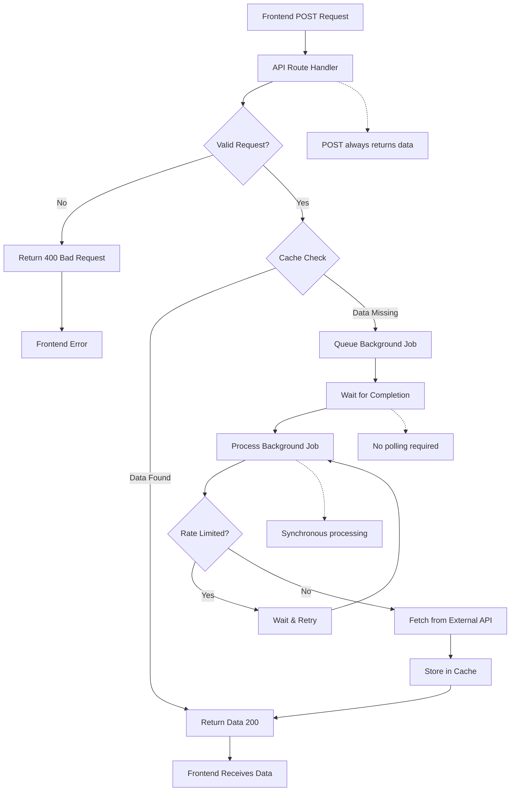
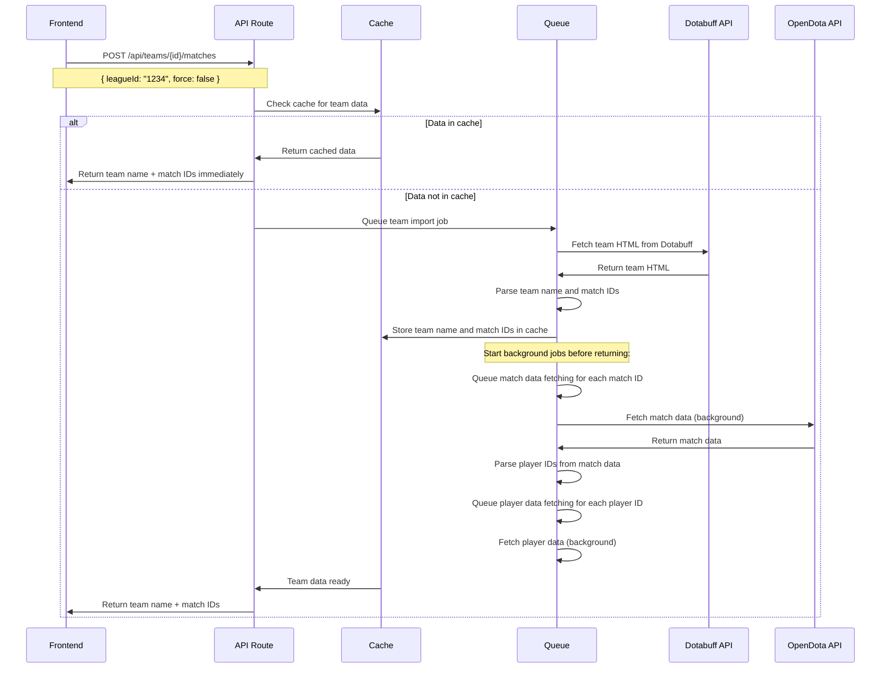
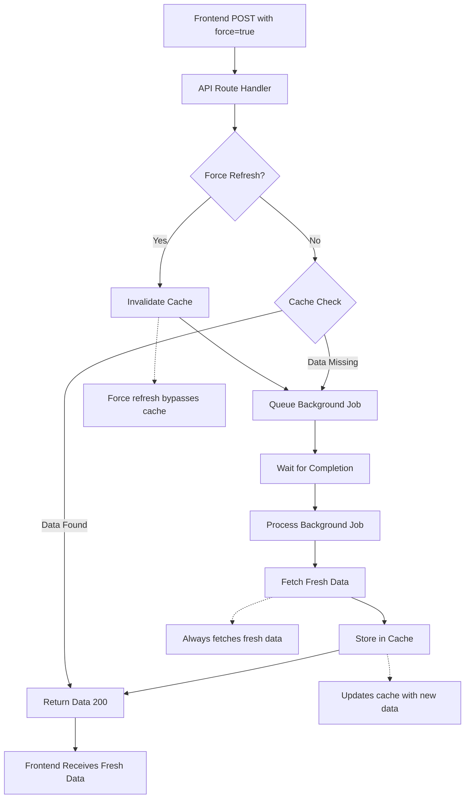
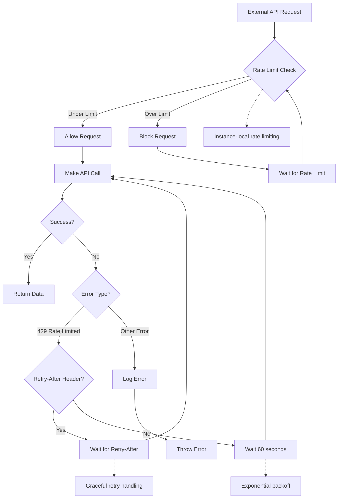

# Dota Data Backend Orchestration System - Implementation Guide

## Overview

This document provides a comprehensive guide to the implemented backend orchestration system for the Dota Data dashboard. The system uses a simplified POST-only pattern that ensures data is always returned to the client, either immediately from cache or after waiting for background processing to complete.

## Architecture Summary

The orchestration system implements the architecture described in `architecture.md` with the following key components:

### 1. Core Infrastructure

#### Cache Service (`src/lib/cache-service.ts`)
- **Redis/Mock Support**: Uses Redis in production, in-memory/file cache in development
- **Queue Management**: Integrated background job queueing with `queueRequest()`
- **Cache Invalidation**: Comprehensive cache clearing for force refresh scenarios
- **Rate Limiting**: Built-in rate limiting for external API calls

#### Request Queue (`src/lib/request-queue.ts`)
- **Background Processing**: In-memory job queue with service-specific processing
- **Deduplication**: Prevents duplicate requests for the same data
- **Queue Statistics**: Real-time queue status monitoring
- **Error Handling**: Graceful error handling and retry logic

#### Orchestration Service (`src/lib/orchestration-service.ts`)
- **High-Level API**: Simplified interface for complex operations
- **Team Import**: Complete team import with match/player queueing
- **Cache Management**: Intelligent cache invalidation and refresh
- **Configuration**: Configurable timeouts and concurrency limits

### 2. API Endpoints

All endpoints follow the simplified POST-only pattern:

#### Team Import (`/api/teams/[id]/matches`)
```typescript
POST /api/teams/{id}/matches
Content-Type: application/json

{
  "leagueId": "1234",
  "force": false
}
```
Returns team name and match IDs immediately if cached, or waits for import to complete:
```json
{
  "id": "2586976-1234",
  "teamId": "2586976",
  "teamName": "Team Liquid",
  "leagueId": "1234",
  "leagueName": "The International",
  "matchIds": ["1234567890", "1234567891"]
}
```

#### Match Data (`/api/matches/[id]`)
```typescript
POST /api/matches/{id}
Content-Type: application/json

{
  "teamId": "2586976",
  "force": false
}
```
Returns match data immediately if cached, or waits for fetch to complete:
```json
{
  "match_id": 1234567890,
  "radiant_team_id": 2586976,
  "dire_team_id": 2586977,
  "players": [...],
  "duration": 2400,
  "radiant_win": true
}
```

#### Player Data (`/api/players/[id]/data`)
```typescript
POST /api/players/{id}/data
Content-Type: application/json

{
  "force": false
}
```
Returns player data immediately if cached, or waits for fetch to complete:
```json
{
  "profile": {
    "account_id": 123456789,
    "personaname": "Miracle-",
    "avatarfull": "..."
  },
  "mmr_estimate": {
    "estimate": 8500
  }
}
```

### 3. Frontend Integration

#### Simplified Data Loading Hook
```typescript
import { useState, useEffect } from 'react';

function useDataLoader<T>(endpoint: string, body: any) {
  const [data, setData] = useState<T | null>(null);
  const [loading, setLoading] = useState(true);
  const [error, setError] = useState<string | null>(null);

  useEffect(() => {
    const fetchData = async () => {
      try {
        setLoading(true);
        const response = await fetch(endpoint, {
          method: 'POST',
          headers: { 'Content-Type': 'application/json' },
          body: JSON.stringify(body)
        });
        
        if (!response.ok) {
          throw new Error(`HTTP ${response.status}: ${response.statusText}`);
        }
        
        const result = await response.json();
        setData(result);
      } catch (err) {
        setError(err instanceof Error ? err.message : 'Unknown error');
      } finally {
        setLoading(false);
      }
    };

    fetchData();
  }, [endpoint, JSON.stringify(body)]);

  return { data, loading, error };
}
```

#### Usage Example
```typescript
function MatchHistoryPage({ matchId, teamId }: { matchId: string, teamId: string }) {
  const { data, loading, error } = useDataLoader(`/api/matches/${matchId}`, {
    teamId,
    force: false
  });

  if (loading) return <div>Loading match data...</div>;
  if (error) return <div>Error: {error}</div>;
  if (!data) return <div>No data available</div>;

  return (
    <div>
      <h2>Match {data.match_id}</h2>
      <p>Duration: {data.duration}s</p>
      <p>Winner: {data.radiant_win ? 'Radiant' : 'Dire'}</p>
    </div>
  );
}
```

## Implementation Details

### Data Flow

#### 1. Synchronous Data Loading Flow
The following flowchart shows the complete data loading process:



#### 2. Team Import Flow
The following sequence diagram shows the team import process:



#### 3. Force Refresh Flow
The following flowchart shows how force refresh works:



#### 4. Rate Limiting Flow
The following flowchart shows how rate limiting is handled:



### Cache Strategy

- **Team Data**: Raw HTML cached, parsed as side effect
- **Match Data**: JSON objects cached with 14-day TTL
- **Player Data**: JSON objects cached with 1-day TTL
- **Mock Mode**: Files written to `mock-data/` directory
- **Real Mode**: Redis cache only

### Queue Management

- **Synchronous Processing**: POST requests wait for background jobs to complete
- **Immediate Response**: Return data immediately if available in cache
- **Side Effects**: Parse and process dependent jobs in background functions
- **Cache Separation**: Never cache processing status, only actual data
- **Error Handling**: Comprehensive logging and graceful degradation

### Configuration

The orchestration service supports configuration via the `OrchestrationConfig` interface:

```typescript
interface OrchestrationConfig {
  maxConcurrentMatches?: number;    // Default: 5
  maxConcurrentPlayers?: number;    // Default: 10
  matchQueueTimeout?: number;       // Default: 30000ms
  playerQueueTimeout?: number;      // Default: 15000ms
  enableAutoRefresh?: boolean;      // Default: false
}
```

## Usage Examples

### Basic Team Import

```typescript
// POST request to import team data
const response = await fetch('/api/teams/2586976/matches', {
  method: 'POST',
  headers: { 'Content-Type': 'application/json' },
  body: JSON.stringify({ leagueId: '1234', force: false })
});

const result = await response.json();
console.log('Team import completed:', result.teamName);
console.log('Matches found:', result.matchIds.length);
```

### Force Refresh

```typescript
// Force refresh all team data
const result = await orchestrationService.importTeam('2586976', '1234', {
  forceRefresh: true
});
```

### Queue Status Monitoring

```typescript
// Get current queue status
const status = orchestrationService.getQueueStatus();
console.log('Active requests:', status.services.opendota.activeSignatures);
```

### Cache Invalidation

```typescript
// Invalidate all cache for a team
await orchestrationService.invalidateTeamCache(
  '2586976', 
  '1234', 
  ['1234567890', '1234567891'], 
  ['123456789', '987654321']
);
```

## Testing

### Manual Testing

Use the provided test script to validate the complete system:

```bash
# Run all tests
node scripts/test-orchestration.js

# Test with custom configuration
node scripts/test-orchestration.js --url http://localhost:3000 --team 2586976
```

### API Testing

Test individual endpoints:

```bash
# Test team import
curl -X POST http://localhost:3000/api/teams/2586976/matches?leagueId=1234 \
  -H "Content-Type: application/json" \
  -d '{"leagueId": "1234"}'

# Test match data
curl http://localhost:3000/api/matches/1234567890

# Test player data
curl http://localhost:3000/api/players/123456789/data
```

## Monitoring and Debugging

### Logging

The system provides comprehensive logging throughout:

- **Cache Service**: Cache hits/misses, queue operations
- **Request Queue**: Job processing, rate limiting
- **Orchestration**: Team import flow, background job coordination
- **API Routes**: Request handling, response status

### Queue Status Monitoring

Monitor queue status in real-time:

```typescript
// Frontend polling
const { status } = useQueueStatus({ pollingInterval: 2000 });

// Backend monitoring
const status = orchestrationService.getQueueStatus();
```

### Error Handling

The system handles various error scenarios:

- **Network Failures**: Automatic retry with exponential backoff
- **API Limits**: Rate limiting and queue management
- **Invalid Data**: Graceful degradation and error reporting
- **Cache Failures**: Fallback to direct API calls

## Performance Considerations

### Optimization Strategies

1. **Concurrent Processing**: Multiple jobs processed simultaneously
2. **Cache Warming**: Background jobs populate cache proactively
3. **Rate Limiting**: Prevents API abuse and ensures reliability
4. **Queue Management**: Prevents duplicate requests and resource waste

### Scalability

The system is designed to scale:

- **Horizontal Scaling**: Stateless design allows multiple instances
- **Queue Persistence**: Redis-based queue for production environments
- **Load Balancing**: Multiple worker processes can handle queues
- **Resource Management**: Configurable concurrency limits

## Troubleshooting

### Common Issues

1. **Queue Not Processing**:
   - Check Redis connection (production)
   - Verify rate limiting settings
   - Review server logs for errors

2. **Cache Not Updating**:
   - Verify cache invalidation calls
   - Check TTL settings
   - Review mock vs real mode configuration

3. **Frontend Not Polling**:
   - Check network connectivity
   - Verify API endpoint availability
   - Review polling interval settings

### Debug Commands

```bash
# View server logs
tail -f logs/server.log
```

## Future Enhancements

### Planned Features

1. **WebSocket Support**: Real-time queue status updates
2. **Advanced Caching**: Multi-level cache with intelligent invalidation
3. **Job Prioritization**: Priority-based queue processing
4. **Metrics Dashboard**: Real-time performance monitoring
5. **Auto-scaling**: Dynamic worker process management

### Integration Opportunities

1. **External APIs**: Support for additional Dota data sources
2. **Analytics**: Integration with analytics platforms
3. **Notifications**: User notifications for completed jobs
4. **Scheduling**: Automated data refresh scheduling

## Conclusion

The Dota Data Backend Orchestration System provides a robust, scalable foundation for handling complex data dependencies while maintaining responsive user experience. The implementation follows the architecture design and provides comprehensive APIs, monitoring, and error handling.

For questions or issues, refer to the server logs and queue status endpoints for debugging information.

## Idempotent POST/GET Polling Pattern

All orchestration endpoints now support both POST and GET:
- **POST**: Checks cache, returns `{ status: 'ready' }` if data is present, `{ status: 'queued' }` and starts background job if not.
- **GET**: Polls for readiness, returns data if ready, or status if not.
- **Idempotency**: POST is idempotent; repeated POSTs return 'ready' if data is present.

### Endpoints:
- `/teams/[id]/matches`
- `/players/[id]/data`
- `/matches/[id]`
- `/players/[id]/stats`
- `/leagues/[id]`

## Example Flow
1. Client POSTs to endpoint to queue data.
2. If not present, receives 'queued' and polls GET until 'ready'.
3. If present, receives 'ready' immediately.
4. Repeated POSTs are safe and return 'ready' if data is present. 