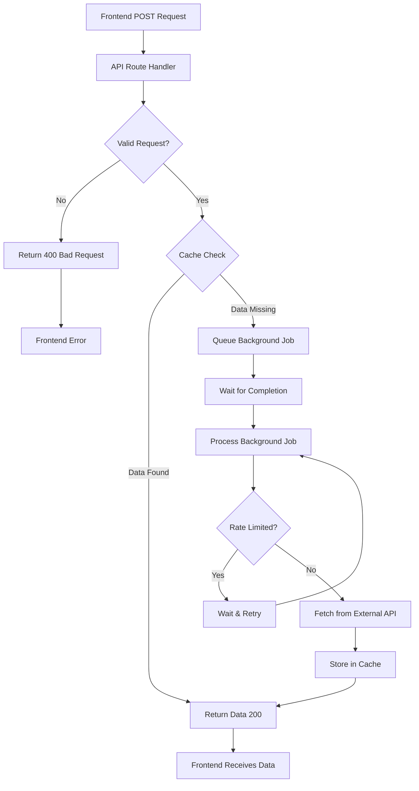
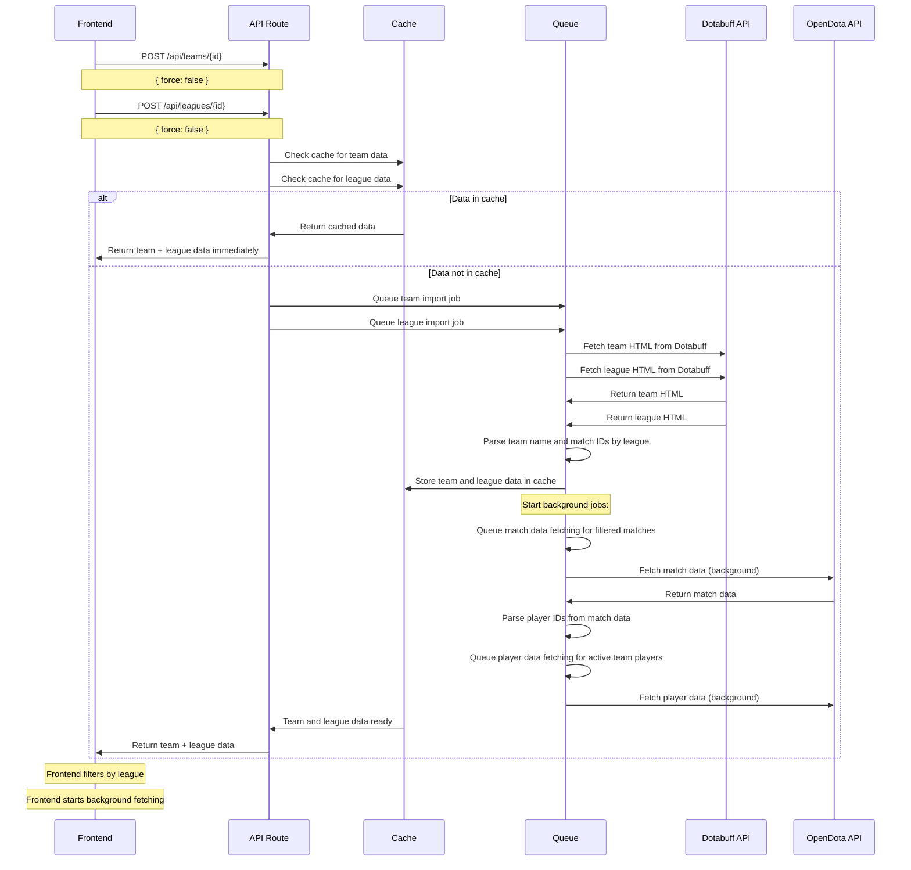
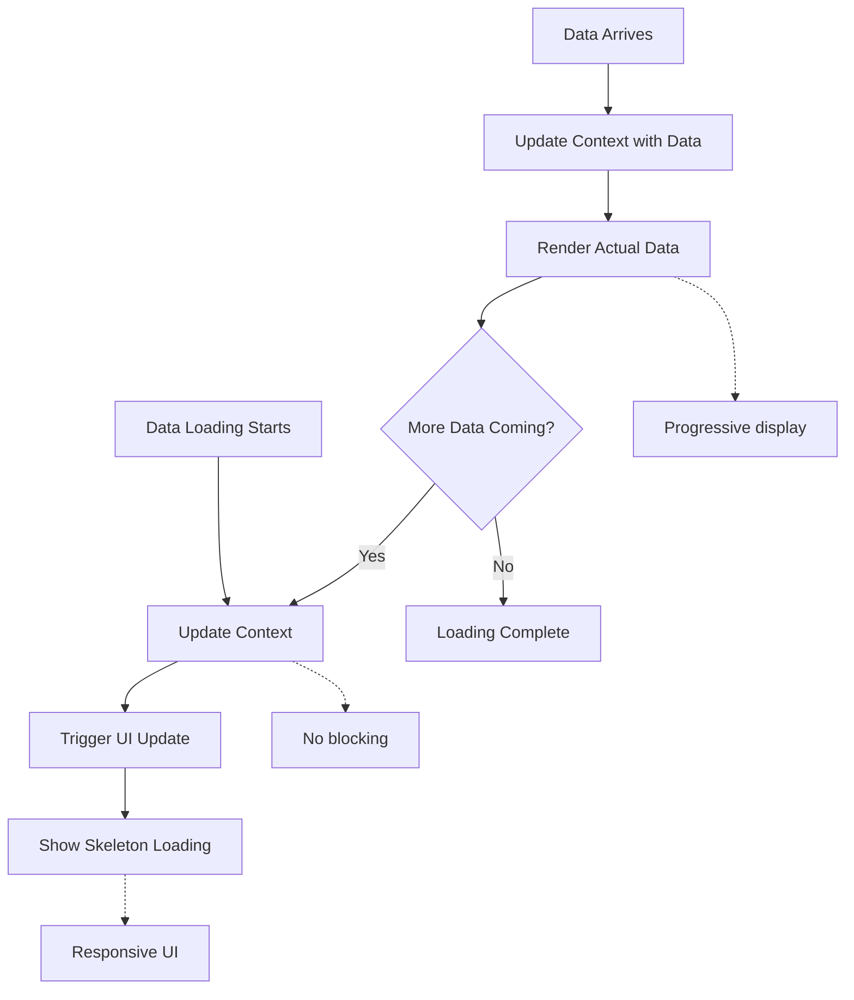

# Dota Data Backend Orchestration System - Implementation Guide

## Overview

This document provides a comprehensive guide to the implemented backend orchestration system for the Dota Data dashboard. The system uses a simplified POST-only pattern that ensures data is always returned to the client, either immediately from cache or after waiting for background processing to complete.

## Architecture Summary

The orchestration system implements the architecture described in `architecture.md` with the following key components:

### 1. Core Infrastructure

#### Cache Service (`src/lib/cache-service.ts`)
- **Redis/Mock Support**: Uses Redis in production, in-memory/file cache in development
- **Queue Management**: Integrated background job queueing with `queueRequest()`
- **Cache Invalidation**: Comprehensive cache clearing for force refresh scenarios
- **Rate Limiting**: Built-in rate limiting for external API calls

#### Request Queue (`src/lib/request-queue.ts`)
- **Background Processing**: In-memory job queue with service-specific processing
- **Deduplication**: Prevents duplicate requests for the same data
- **Queue Statistics**: Real-time queue status monitoring
- **Error Handling**: Graceful error handling and retry logic

#### Orchestration Service (`src/lib/orchestration-service.ts`)
- **High-Level API**: Simplified interface for complex operations
- **Team Import**: Complete team import with match/player queueing
- **Cache Management**: Intelligent cache invalidation and refresh
- **Configuration**: Configurable timeouts and concurrency limits

### 2. API Endpoints

All endpoints follow the simplified POST-only pattern:

#### Team Import (`/api/teams/[id]`)
```typescript
POST /api/teams/{id}
Content-Type: application/json

{
  "force": false
}
```
Returns team data with all matches organized by league:
```json
{
  "teamName": "Team Liquid",
  "matchIdsByLeague": {
    "16435": [
      {
        "matchId": "8054301932",
        "result": "win",
        "duration": "34:56",
        "heroes": ["Mars", "Tusk", "Medusa", "Mirana", "Ember Spirit"],
        "opponent": {
          "teamId": "9517701",
          "teamName": "SEA10KMMR"
        },
        "date": "2024-09-10T00:40:27+00:00"
      }
    ]
  }
}
```

#### League Data (`/api/leagues/[id]`)
```typescript
POST /api/leagues/{id}
Content-Type: application/json

{
  "force": false
}
```
Returns league information for validation:
```json
{
  "id": "16435",
  "name": "RD2L Season 33",
  "region": "North America"
}
```

#### Match Data (`/api/matches/[id]`)
```typescript
POST /api/matches/{id}
Content-Type: application/json

{
  "force": false
}
```
Returns detailed match data:
```json
{
  "match_id": 8054301932,
  "radiant_team_id": 2586976,
  "dire_team_id": 2586977,
  "players": [...],
  "duration": 2400,
  "radiant_win": true
}
```

#### Player Data (`/api/players/[id]`)
```typescript
POST /api/players/{id}
Content-Type: application/json

{
  "force": false
}
```
Returns player profile data:
```json
{
  "profile": {
    "account_id": 123456789,
    "personaname": "Miracle-",
    "avatarfull": "..."
  },
  "mmr_estimate": {
    "estimate": 8500
  }
}
```

### 3. Frontend Integration

#### League Filtering Support
The backend provides comprehensive data that the frontend filters by league:

1. **Team Data Structure**: `/api/teams/[id]` returns all matches organized by league
2. **Frontend Filtering**: Frontend selects league and filters displayed data
3. **League Validation**: Frontend validates league exists using `/api/leagues/[id]`
4. **Background Processing**: Frontend starts background fetching of filtered matches

#### Real-Time Updates
The backend supports real-time frontend updates:

1. **Immediate Response**: All endpoints return data immediately (no polling)
2. **Background Processing**: Frontend can start background jobs for additional data
3. **Context Updates**: Frontend contexts update in real-time as data loads
4. **Loading States**: Frontend shows skeleton loading states during data fetching

#### Error Handling
Standardized error responses for frontend integration:

1. **HTTP Status Codes**: 200 (success), 400 (bad request), 500 (server error)
2. **Error Messages**: Clear error messages for debugging
3. **League Validation**: Specific errors for missing leagues
4. **Empty States**: Support for empty data scenarios

## Implementation Details

### Data Flow

#### 1. Synchronous Data Loading Flow
The following flowchart shows the complete data loading process:



#### 2. Team Import with League Filtering
The following sequence diagram shows the team import process with league filtering:



#### 3. Frontend League Filtering Flow
The following flowchart shows how the frontend handles league filtering:

```mermaid
flowchart TD
    %% User Input
    USER[User enters Team ID + League ID] --> VALIDATE[Validate Input]
    
    %% Parallel API Calls
    VALIDATE --> PARALLEL[Call APIs in Parallel]
    PARALLEL --> TEAM_API[POST /api/teams/{id}]
    PARALLEL --> LEAGUE_API[POST /api/leagues/{id}]
    
    %% Validation
    TEAM_API --> CHECK_LEAGUE{League in Team Data?}
    LEAGUE_API --> CHECK_LEAGUE
    
    %% Error Path
    CHECK_LEAGUE -->|No| ERROR[Show Error: No matches for league]
    
    %% Success Path
    CHECK_LEAGUE -->|Yes| FILTER[Filter Matches by League]
    
    %% Background Processing
    FILTER --> BACKGROUND[Start Background Fetching]
    BACKGROUND --> FETCH_MATCHES[Fetch Match Details]
    FETCH_MATCHES --> EXTRACT_PLAYERS[Extract Player IDs]
    EXTRACT_PLAYERS --> FETCH_PLAYERS[Fetch Player Data]
    
    %% Real-Time Updates
    FETCH_MATCHES --> UPDATE_MATCHES[Update Match Context]
    FETCH_PLAYERS --> UPDATE_PLAYERS[Update Player Context]
    
    %% UI Updates
    UPDATE_MATCHES --> DISPLAY_MATCHES[Display Matches]
    UPDATE_PLAYERS --> DISPLAY_PLAYERS[Display Players]
    
    %% Notes
    N1[Real-time updates]
    N2[Skeleton loading states]
    N3[League-specific display]
    
    UPDATE_MATCHES -.-> N1
    DISPLAY_MATCHES -.-> N2
    DISPLAY_MATCHES -.-> N3
```

#### 4. Real-Time Update Flow
The following flowchart shows how real-time updates work:



## Frontend Integration Patterns

### Team Import Flow
1. Frontend calls `/api/teams/[id]` and `/api/leagues/[id]` in parallel
2. Backend returns comprehensive team data with all matches organized by league
3. Frontend validates league exists in team data
4. Frontend starts background fetching of filtered matches
5. Frontend extracts player IDs and fetches player data for active team players
6. Frontend updates contexts in real-time as data loads

### Match History Flow
1. Frontend uses league-filtered match IDs from team data
2. Frontend fetches all matches in parallel using `/api/matches/[id]`
3. Frontend displays matches as they load with skeleton loading states
4. Frontend handles empty states for leagues with no matches

### Player Stats Flow
1. Frontend uses player IDs from active team
2. Frontend fetches player data using new endpoints:
   - `/api/players/[id]` - Basic player data
   - `/api/players/[id]/matches` - Match history
   - `/api/players/[id]/heroes` - Hero statistics
   - `/api/players/[id]/totals` - Player totals
   - `/api/players/[id]/wl` - Win/loss record
3. Frontend displays player statistics in real-time
4. Frontend handles loading and error states

### Error Handling Patterns
- **League Validation**: Frontend validates league exists before proceeding
- **Empty States**: Generic "No matches found for this league" messages
- **Manual Add**: Support for manual match/player addition
- **Clear Errors**: Specific error messages for debugging

### Real-Time Updates
- **Context Updates**: Frontend contexts update as data loads
- **Skeleton Loading**: Show skeleton states during data fetching
- **Progressive Display**: Display data as it becomes available
- **Responsive UI**: Maintain responsive interface throughout

## Testing and Validation

### API Testing
```bash
# Test teams endpoint
curl -X POST http://localhost:3000/api/teams/9517508 \
  -H "Content-Type: application/json" \
  -d '{"force": false}'

# Test leagues endpoint
curl -X POST http://localhost:3000/api/leagues/16435 \
  -H "Content-Type: application/json" \
  -d '{"force": false}'

# Test player endpoints
curl -X POST http://localhost:3000/api/players/40927904 \
  -H "Content-Type: application/json" \
  -d '{"force": false}'

# Test heroes endpoint
curl -X POST http://localhost:3000/api/heroes \
  -H "Content-Type: application/json" \
  -d '{"force": false}'
```

### Frontend Integration Testing
- Test league filtering functionality
- Test real-time data updates
- Test error handling scenarios
- Test empty state handling
- Test background data fetching

## Key Implementation Benefits

### 1. Simplified Frontend Code
- No complex polling logic
- Direct data loading patterns
- Clear error handling
- Standardized API calls

### 2. Better User Experience
- Immediate data availability
- Real-time updates
- Responsive loading states
- League-specific filtering

### 3. Improved Performance
- No unnecessary polling requests
- Parallel data fetching
- Efficient caching
- Background processing

### 4. Easier Maintenance
- Standardized API patterns
- Clear separation of concerns
- Modular component structure
- Comprehensive error handling

## Documentation Updates

### Frontend Integration Guide
- League filtering implementation details
- Real-time update patterns
- Error handling strategies
- Background data fetching approach

### API Reference
- Updated endpoint documentation
- Request/response examples
- Error code definitions
- League filtering documentation

This comprehensive implementation guide ensures the backend orchestration system supports all frontend requirements while maintaining clean, maintainable code and providing excellent user experience. 